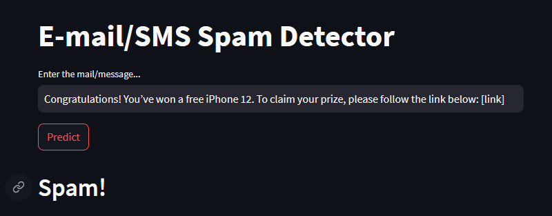

# E-Mail/SMS Spam Classifier

Welcome to the **SMS Spam Detection project**! This project aims to build a machine learning model to classify SMS messages as either *"spam"* or *"ham"* (non-spam). We use a dataset containing labeled messages for training and evaluation.

## Project Overview

E-Mail & SMS spam is a common issue that affects web users. The goal of this project is to develop a robust E-Mail/SMS spam detection model that can automatically classify incoming text messages as spam or not. We leverage *natural language processing (NLP) techniques* and machine learning algorithms like *Naive Bayer's, K Nearest Neighbours, Random Forest,* and more to achieve this.

## Project Structure

The project is organized as follows:

- **dataset**: This folder contains the dataset used, named "spam.csv."
- **resources**: This folder includes images and other files related to the project.
- **.gitignore**: Gitignore file to specify which files or directories should be ignored in version control.
- **AboutTheCode.md**: Detailed explanation of the code and its components.
- **app.py**: A Streamlit web app to host the model locally for interactive testing.
- **code.txt**: A backup text file containing the code used in the project.
- **model.pkl**: Serialized machine learning model for SMS spam detection.
- **vectorizer.pkl**: Serialized feature vectorizer (TF-IDF or Count Vectorizer) used for text data.
- **requirements.txt**: List of Python packages and dependencies required to run the project.
- **nltk.txt**: Text file containing NLTK library imports, including stopwords and punkt.
- **spam-detection.ipynb**: Jupyter Notebook source file containing the code for data preprocessing, model training, and evaluation.

## Getting Started

To get started with this project, follow these steps:

1. Clone the repository to your local machine:

```bash
git clone https://github.com/arindal1/email-spam-detector.git
```

2. Navigate to the project directory:

```bash
cd email-spam-detector
```

3. Create a Python virtual environment (recommended):

```bash
python -m venv venv
```

4. Activate the virtual environment:

```bash
# On Windows
venv\Scripts\activate

# On macOS and Linux
source venv/bin/activate
```

5. Install the project dependencies:

```bash
pip install -r requirements.txt
```

6. Explore the Jupyter Notebook (`spam-detection.ipynb`) for in-depth details on data preprocessing, model training, and evaluation.

7. To run the Streamlit app, execute the following command:

```bash
streamlit run app.py
```

This will launch a local web app for SMS spam detection.
<br>
<br>


## Tech Stack

- Python
- Jupyter Notebook
- StreamLit

**Note:** I tried to host the model globally using Heroku, but couldn't because of their Billing policies. If you have Heroku, you can create a new app and host the model globally.

## About the Dataset

The dataset used in this project is available on Kaggle: [SMS Spam Collection Dataset](https://www.kaggle.com/datasets/uciml/sms-spam-collection-dataset). It contains SMS messages labeled as "spam" or "ham." You can download the dataset from the provided link and place it in the "dataset" folder.

## About the Code

For detailed information about the code and its components, please refer to the [AboutTheCode.md](./AboutTheCode.md) file in this repository.

## Contributions

See the [open issues](https://github.com/arindal1/Dogs-Vs-Cats-Classifier/issues) for a list of proposed features (and known issues). <br>
Contributions to this project are welcome! If you have any ideas, bug reports, or feature requests, please open an issue or submit a pull request. Contributions are what make the open-source community an amazing place to learn, inspire, and create. Any contributions you make are **greatly appreciated**.

1. Fork the Project
2. Create your Feature Branch (`git checkout -b feature/AmazingFeature`)
3. Commit your Changes (`git commit -m 'Add some AmazingFeature'`)
4. Push to the Branch (`git push origin feature/AmazingFeature`)
5. Open a Pull Request

## Contact

If you have any questions or suggestions related to this project, you can reach out to me at:

- GitHub: [arindal1](https://github.com/arindal1)
- LinkedIn: [arindalchar](https://www.linkedin.com/arindalchar/)

## External Links

- [SMS Spam Collection Dataset](https://www.kaggle.com/datasets/uciml/sms-spam-collection-dataset)
- [StreamLit](https://docs.streamlit.io/)
- [Heroku](https://dashboard.heroku.com/apps)

---

**Note:** This is a personal project created for educational and demonstrative purposes. I made this project just for fun and learn more about Machine Learning in the process, and also record my progress in this field. Feel free to customize the content, links, and images to match your project's specifics.

### Happy learning and predicting! 😁
